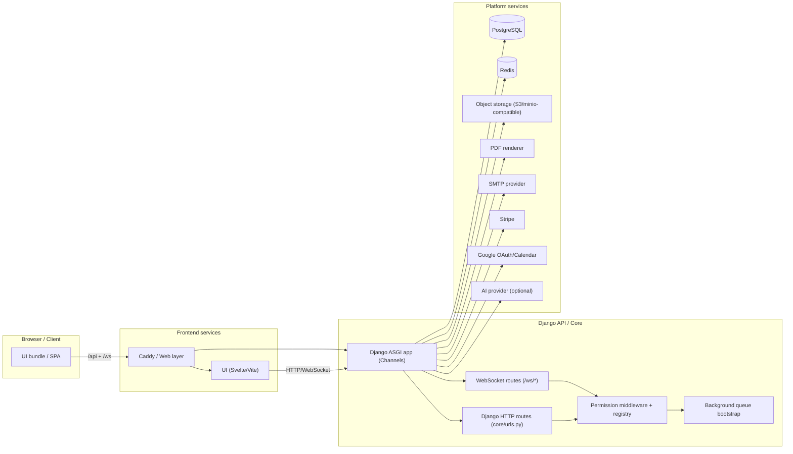

# Architecture overview

[Docs hub](../README.md) · [Functionality map](./functionality-map.md) · [Permissions](./permissions-and-access.md) · [Deployment/runtime](./deployment-runtime.md) · [Coverage gaps](./coverage-gaps.md) · [Coverage metrics](./coverage-metrics.md)

## System shape

Assozeta is a full-stack web platform with a Django backend + DRF API and a Svelte single-page frontend.

- **Backend:** `BE/`
- **Frontend:** `UI/`
- **Operational stack:** Docker services in `selfhost/`

Core runtime components:

- HTTP/WebSocket API (Django + Channels ASGI entrypoint)
- Stateful persistence (`postgres` / `redis`)
- Storage abstraction (local/S3-compatible)
- Background processing (Celery worker + beat)
- PDF rendering service
- Optional AI tooling for data export/agent flows
- Frontend reverse proxy and serving layer

## Top-level inventory snapshot

- Backend endpoint patterns (unique, normalized): **353**
- Frontend registered routes: **85**
- Permission registry entries: **241**
- Frontend routes with explicit permission checks: **49**
- Frontend routes without explicit checks: **36**
- Unmapped backend routes in current permission registry: **89**
- Permissions without a backend route match: **1**

Backend route counts by Django app (`docs/matrix/architecture-inventory.json`):

- `application`: 304
- `communications`: 15
- `docmanager`: 16
- `chat`: 1
- `instance`: 8
- `core`: 10

## Top-level backend domain distribution

Most common API prefixes (from current inventory):

- `subscription` (51)
- `course` (25)
- `payment` (20)
- `camps-and-retreats` (16)
- `document` (16)
- `communications` (15)
- `modules` (13)
- `instructor` (12)
- `personas` (11)
- `balance-sheet` (10)
- `profile` (10)
- `association` (8)
- `carnet` (8)
- `oauth2` (8)
- and many smaller prefixes (audit logs, reporting, import/export, etc.)

## Deployment/runtime topology

## Backend module responsibilities

### `BE/application`

Large domain module for core product functionality:

- Memberships and persons
- Courses and attendees
- Payments and accounting
- Reports and exports
- Audit logs
- Websocket endpoints for live updates and health channels
- AI tools and MCP/agent integration hooks

### `BE/communications`

- Email/post send paths
- Communication templates and workflow/message management APIs
- Communication automation entrypoints and audit views

### `BE/docmanager`

- Document endpoints for PDFs/templates/retrieval
- Subscription invoices, medical certificates, and download/access paths

### `BE/instance`

- Public instance lifecycle endpoints
  - `status`
  - `config`
  - `configure`
  - logo and manifest support

### `BE/notifications`

- WebSocket notification channel registration (`/ws/notifications/`)
- Consumers consume updates, mostly from channel layers and scheduled producers

### `BE/chat`

- Chat test and websocket channel (`/ws/agent/`) used by agent tooling

### `BE/core`

- Top-level URL composition
- Global middleware chain
- ASGI/WSGI entry points
- settings and system-level configuration

## Frontend architecture decomposition

### Route entry points (`UI/src/routes.js`)

- Main route container with lazy-loaded route modules and condition guards
- Access state through Svelte stores (`UI/src/store/stores.js`)
- Endpoint composition from `UI/endpoints.js`
- Permission checks in route guards via `Permissions.js`

### UI domain clusters

- `members`: people list, draft/import/archive modules
- `course`: course catalog, instructors, carnet integrations
- `subscription`: subscription detail/list/upgrade
- `communication`: messages and automations
- `payment`/`accounting`: payment and invoice flows
- `calendar`, `camps-and-retreats`, `reports`, `profile`, `search`
- auth and onboarding routes (`/login`, `/welcome`, `/setup`, `/reset`)

## Data movement patterns

- **UI -> API**: all domain actions go through centralized endpoint map (`UI/endpoints.js`).
- **State persistence**: local storage stores session/auth flags and UI metadata (`sessionToken`, `role`, `permissions`, filters, etc.).
- **Realtime**: websocket channels are used for notifications/updates and agent interactions.
- **Async tasks**: UI-triggered domain actions often enqueue Celery jobs in background for payment status, reminders, cleanup, exports.

## References

- `docs/diagrams/rendered/README.md` and rendered SVG/PDFs produced by `docs/scripts/render_mermaid_diagrams.mjs`
- `docs/matrix/architecture-inventory.md` (expanded inventory)
- `docs/matrix/architecture-inventory.json` (machine-readable source)
- `BE/core/urls.py`
- `BE/application/urls.py`
- `UI/src/routes.js`
- `UI/src/utils/Permissions.js`
