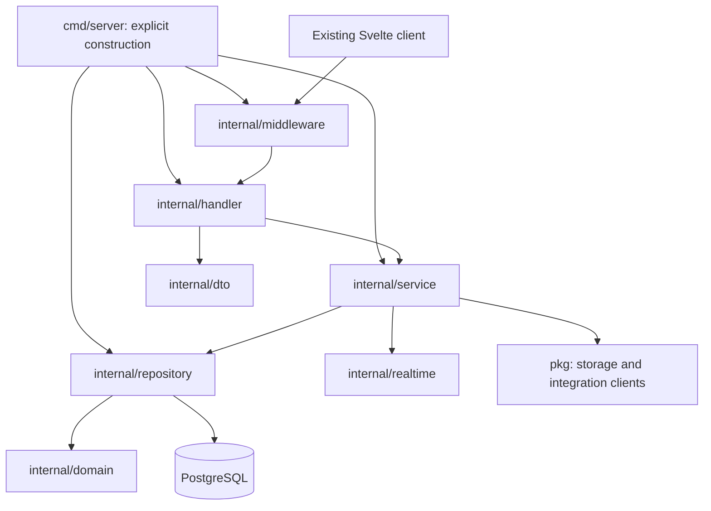

# Django → Go: architecture assessment and migration specification

Status: proposed implementation specification; no backend implementation or deployment changes.

Assessment date: 2026-09-29. Assozeta baseline: `76616210b53e9fb16eaa7e2cb6336e42ed2f7249`, branch `refactor/golang-backend`. Reference: Kuayle commit [`5025d2a6bc966d0d08c49832ff9c7c86184207cd`](https://github.com/carbogninalberto/kuayle/tree/5025d2a6bc966d0d08c49832ff9c7c86184207cd). All Kuayle observations below refer to that checked-out commit, not an assumed generic Go architecture.

## 1. Decision and scope

Migrate Assozeta to **Kuayle's layered Go backend architecture**: one Go module, explicit constructor wiring in `cmd/server/main.go`, Echo HTTP handlers, DTOs, application services, repository interfaces and handwritten PostgreSQL queries through sqlx/pgx. Retain its separate middleware, realtime, configuration, migration, and utility packages.

Strict architecture alignment means adopting those boundaries, dependency conventions, libraries, and deployment patterns. It does not mean replacing Assozeta's association domain with Kuayle workspaces or silently changing existing clients to Kuayle's HTTP/authentication protocol. Compatibility code belongs inside the same layers. Proposed additions required by Assozeta are identified explicitly below; they are not claims about existing Kuayle functionality.

This assessment specifies the target and the migration work. It does not authorize deleting Django, changing live data, publishing a release, or implementing a new frontend. The current Svelte SPA remains the client. No microservices split, ORM replacement such as GORM, generic dependency injection framework, CQRS framework, or event-sourced business database is proposed.

## 2. Evidence and current architecture

The assessment inspected source in both repositories, including entrypoints, handlers/views, services, repositories/models, authentication, permissions, background execution, storage, deployment, and test definitions. It did not inspect production records or execute either application. Existing generated architecture documentation is useful orientation, not an exhaustive current contract.

A static AST count at the Assozeta baseline finds **378 `path`/`re_path` calls across `BE/**/urls.py`**, **75 `test_*.py` files**, and **46 non-`__init__` Python migration files**. URL declarations include include nodes, conditional routes, and potentially unmounted URL modules; this is not a count of live endpoints. The older documentation's 353 normalized patterns and 89 permission gaps are historical inventory results, not newly verified runtime measurements. Migration files include a squashed history, so their count is not the number of historical schema changes.

| Current responsibility | Source evidence | Migration implication |
| --- | --- | --- |
| HTTP routing and serialization | [core URLs](../../BE/core/urls.py), [application URLs](../../BE/application/urls.py), `BE/application/views/`, `BE/application/serializers/` | Inventory methods, payloads, permission rules and side effects individually; paths alone are insufficient. |
| ORM and business lifecycle | `BE/application/models/`, [signals](../../BE/application/signals.py), [app initialization](../../BE/application/apps.py), [subscription service](../../BE/application/services/subscription_service.py) | Model managers, `save`/`delete` overrides and signal receivers must become explicit queries and service operations. |
| Identity and access | [authentication](../../BE/core/authentication.py), [impersonation](../../BE/application/impersonation.py), [scope enforcement](../../BE/application/impersonation_scope.py), [permission registry](../../BE/application/permissions_registry.py) | Actor, effective person and association scope are distinct identities; preserve all three. |
| Auth protocol | [settings](../../BE/core/settings.py), [token service](../../BE/application/services/jwt_token_service.py), [UI middleware](../../UI/src/utils/ApiMiddleware.js) | Preserve EdDSA tokens, claim names, response fields and refresh behavior until deliberately versioned. |
| Realtime | [ASGI](../../BE/core/asgi.py), [WS authentication](../../BE/notifications/middleware.py), `BE/notifications/consumers.py`, `BE/application/consumers.py`, `BE/application/chat/` | Four existing channel paths and Redis-backed delivery require more than a direct hub substitution. |
| Background work | [Celery](../../BE/core/celery.py), `BE/application/tasks.py`, `BE/docmanager/tasks.py`, `BE/instance/tasks.py` | Scheduled financial operations, reminders, exports and cleanup must retain durable execution and operational visibility. |
| Files and rendering | `BE/docmanager/`, [download tokens](../../BE/docmanager/download_tokens.py), `selfhost/renderer/` | Keep private file authorization, token semantics and document rendering contracts. |
| Instance lifecycle | `BE/instance/restore/`, `BE/instance/sso/`, [Compose](../../selfhost/compose.yml), [Caddy](../../selfhost/caddy/Caddyfile) | Setup, maintenance, restore coordination, root SSO paths and updater behavior are part of backend parity. |

The backend is a domain-heavy monolith, not merely CRUD over PostgreSQL. For example, `membership_created_callback` creates a payment and links it to a course subscription; deletion receivers coordinate installments and unpaid payments; subscription/payment signals enqueue communication workflows; audit-log insertion creates an association index. A Go insert or delete that only reproduces the primary row change would lose product behavior.

## 3. How Kuayle is actually built

The following references are pinned to the inspected source.

### 3.1 Package layout and dependencies

| Package | Observed responsibility | Reference |
| --- | --- | --- |
| `cmd/server` | Configuration, database pool, repositories, services, handlers, middleware and route registration; also `migrate` CLI dispatch | [main.go](https://github.com/carbogninalberto/kuayle/blob/5025d2a6bc966d0d08c49832ff9c7c86184207cd/BE/cmd/server/main.go) |
| `internal/config` | Typed environment configuration using envconfig, validation and optional subsystem settings | [config.go](https://github.com/carbogninalberto/kuayle/blob/5025d2a6bc966d0d08c49832ff9c7c86184207cd/BE/internal/config/config.go) |
| `internal/domain` | Domain structs, UUIDs, timestamps, JSON/DB tags and permission definitions | [team.go](https://github.com/carbogninalberto/kuayle/blob/5025d2a6bc966d0d08c49832ff9c7c86184207cd/BE/internal/domain/team.go) |
| `internal/dto` | Request/response structs and validation tags; pointer fields for optional updates | [team.go](https://github.com/carbogninalberto/kuayle/blob/5025d2a6bc966d0d08c49832ff9c7c86184207cd/BE/internal/dto/team.go) |
| `internal/handler` | Echo binding, validation, context extraction, service invocation, response conversion | [team.go](https://github.com/carbogninalberto/kuayle/blob/5025d2a6bc966d0d08c49832ff9c7c86184207cd/BE/internal/handler/team.go) |
| `internal/service` | Business orchestration; constructor-injected repository interfaces; some services also receive realtime and other services | [team.go](https://github.com/carbogninalberto/kuayle/blob/5025d2a6bc966d0d08c49832ff9c7c86184207cd/BE/internal/service/team.go) |
| `internal/repository` | Interfaces in `interfaces.go`, concrete sqlx repositories, parameterized SQL and transactions | [interfaces.go](https://github.com/carbogninalberto/kuayle/blob/5025d2a6bc966d0d08c49832ff9c7c86184207cd/BE/internal/repository/interfaces.go), [team.go](https://github.com/carbogninalberto/kuayle/blob/5025d2a6bc966d0d08c49832ff9c7c86184207cd/BE/internal/repository/team.go) |
| `internal/middleware` | Authentication, workspace membership, permissions, throttling, logging, recovery, CORS and security headers | [auth.go](https://github.com/carbogninalberto/kuayle/blob/5025d2a6bc966d0d08c49832ff9c7c86184207cd/BE/internal/middleware/auth.go) |
| `internal/realtime` | In-process hub, workspace/user fanout and connection read/write pumps | [hub.go](https://github.com/carbogninalberto/kuayle/blob/5025d2a6bc966d0d08c49832ff9c7c86184207cd/BE/internal/realtime/hub.go) |
| `pkg` | Response, validation, JWT, crypto, storage and integration helpers | [response.go](https://github.com/carbogninalberto/kuayle/blob/5025d2a6bc966d0d08c49832ff9c7c86184207cd/BE/pkg/response/response.go), [storage.go](https://github.com/carbogninalberto/kuayle/blob/5025d2a6bc966d0d08c49832ff9c7c86184207cd/BE/pkg/storage/storage.go) |
| `migrations` | Ordered SQL up/down files applied with golang-migrate | [migrations](https://github.com/carbogninalberto/kuayle/tree/5025d2a6bc966d0d08c49832ff9c7c86184207cd/BE/migrations) |

This is a pragmatic layered design, not strict framework-independent hexagonal architecture. Services import DTOs and repository interfaces; some repository interfaces expose `*sqlx.Tx`. The composition root wires analytics and uploads directly to repositories in some cases. Preserve the normal service path for Assozeta business mutations; do not invent a domain-port layer and attribute it to Kuayle.



### 3.2 Request and transaction lifecycle

A representative team creation request is registered in the composition root, passes authentication/workspace/permission middleware, binds and validates a DTO, and calls a concrete service. The service creates domain values and invokes repository interfaces; the repository executes SQL with request context and fills returned timestamps. The handler converts the result to a response DTO. Constructors are ordinary `New...` functions, without container magic.

Transactions have two observed forms: the issue service begins a transaction through its repository and passes it to related operations; workspace creation encapsulates an aggregate transaction inside the repository. Use these existing patterns according to the transaction boundary. Do not assume every reference operation is atomic: team creation currently has separate writes and ignores some secondary errors. Assozeta financial operations must explicitly handle all required writes and errors. References: [issue service](https://github.com/carbogninalberto/kuayle/blob/5025d2a6bc966d0d08c49832ff9c7c86184207cd/BE/internal/service/issue.go), [workspace repository](https://github.com/carbogninalberto/kuayle/blob/5025d2a6bc966d0d08c49832ff9c7c86184207cd/BE/internal/repository/workspace.go).

### 3.3 Concrete technology baseline

The inspected [go.mod](https://github.com/carbogninalberto/kuayle/blob/5025d2a6bc966d0d08c49832ff9c7c86184207cd/BE/go.mod) declares Go `1.25.12`, Echo v4, sqlx with pgx v5, golang-migrate v4, validator v10, golang-jwt v5, google/uuid, logrus, AWS SDK v2 and nhooyr WebSocket. Adopt this library family and record any later version changes separately; these are observed versions, not a claim that they are the latest available.

The server connects with `sqlx.Connect("pgx", ...)` and configures a pool. It registers `/health` and `/ready`, public auth routes, authenticated groups and workspace-scoped groups. Success helpers return the data directly; errors use `{ "error": { "code", "message", "details"? } }`. Do not assume a success `data` envelope.

The [Dockerfile](https://github.com/carbogninalberto/kuayle/blob/5025d2a6bc966d0d08c49832ff9c7c86184207cd/BE/Dockerfile) builds a CGO-disabled server and packages it with SQL migrations in an Alpine image running as a non-root user. The migration CLI supports `up`, one-step `down`, and `version`. [Backend CI](https://github.com/carbogninalberto/kuayle/blob/5025d2a6bc966d0d08c49832ff9c7c86184207cd/.github/workflows/test.yml) provisions PostgreSQL, applies migrations and runs Go tests with race detection and coverage.

### 3.4 Reference limits that matter for this migration

- Kuayle generates HS256 JWTs with 15-minute access and seven-day refresh lifetimes; its auth service uses bcrypt and persisted refresh-token hashes. Authentication checks `access_token` cookies before Bearer headers. These are incompatible with Assozeta's existing protocol. See [JWT helper](https://github.com/carbogninalberto/kuayle/blob/5025d2a6bc966d0d08c49832ff9c7c86184207cd/BE/pkg/jwt/jwt.go) and [auth service](https://github.com/carbogninalberto/kuayle/blob/5025d2a6bc966d0d08c49832ff9c7c86184207cd/BE/internal/service/auth.go).
- The realtime hub is local to the process and skips a send when a client's buffer is full. Redis configuration in the reference is not evidence of Redis-backed hub fanout. Its workspace WebSocket route and event envelope differ from Assozeta's channels.
- The server contains a simple refresh-token cleanup ticker. This is not a durable replacement for Celery. Kuayle's optional Dev Machines subsystem separately implements persisted operations with leases and `FOR UPDATE ... SKIP LOCKED`: [repository](https://github.com/carbogninalberto/kuayle/blob/5025d2a6bc966d0d08c49832ff9c7c86184207cd/BE/internal/repository/dev_machine.go). That is a reference pattern for durable execution, not an existing general-purpose task queue.
- `TECHNICAL.md` primarily specifies Dev Machines. Those machine runtimes, agents, Docker control plane and issue-tracker features are outside Assozeta's migration scope.

## 4. Target package specification

For coexistence, the proposed temporary module root is `BE-go/`; after Django retirement it moves to `BE/`. This temporary location avoids mixing the Django and Go builds while reproducing Kuayle's internal layout. No directories in this example have been created by this assessment.

```text
BE-go/
  go.mod / go.sum
  cmd/server/main.go
  internal/
    config/config.go
    domain/          # association.go, subscription.go, payment.go, ...
    dto/             # request and response structs by domain
    handler/         # Echo handlers by domain
    middleware/      # auth, identity, association/group scope, permissions
    service/         # explicit use cases and side-effect orchestration
    repository/      # interfaces.go and sqlx implementations
    realtime/        # hub and Assozeta event compatibility
  pkg/
    response/ validate/ jwt/ crypto/ storage/
  migrations/        # Go-owned SQL migrations only
  Dockerfile
```

Additional integration clients, durable job execution and compatibility helpers must fit these packages or be recorded as named extensions. Do not copy Kuayle's module path into Assozeta; choose an Assozeta-owned module path when scaffolding.

### Binding implementation rules

1. `cmd/server` owns construction and route registration. No hidden initialization that changes business state.
2. Handlers bind transport input, validate it, extract trusted identity, invoke services and map results/errors. They must not reproduce Django signal logic or embed SQL.
3. DTOs preserve wire field names, date/decimal encodings, null behavior and empty arrays. Updates requiring absent/null/value distinctions need explicit presence tracking; plain Go pointers alone cannot distinguish missing from explicit JSON null.
4. Services own business rules, cross-record consistency, permission-sensitive resource checks and side effects. They accept `context.Context` and explicit trusted identity/scope values, not Echo contexts.
5. Repository interfaces live in `internal/repository/interfaces.go`, following Kuayle. Implementations own SQL and carry association/group predicates into reads and writes. A UUID lookup alone does not establish authorization.
6. Domain structs represent persisted concepts and invariants without Django active-record behavior. DTO conversion must avoid leaking private columns.
7. Use sqlx transactions as in the reference. All writes in one invariant share the transaction; failure rolls back. Publish external effects only after commit, using durable intent where loss matters.
8. Use `pkg/storage.Backend`'s streaming Put/Get/Delete/URL pattern for local and S3-compatible implementations. Assozeta authorization remains above that interface.
9. Keep existing public paths and payloads during migration; Kuayle-style response utilities may provide legacy mappings. Changing response envelopes requires a separate client/API change.

### Domain mapping

Each row becomes same-named files across the existing layer packages, not a separate service deployment.

| Django area | Go domain/service grouping | Required behavior |
| --- | --- | --- |
| Users, association, collaborators, instructor identity | `auth`, `association`, `identity`, `permission` | Login, onboarding, account lifecycle, connected users, group scope, instructor visibility, impersonation and audit actor |
| Associates, subscriptions, family registration, forms, signatures | `associate`, `subscription`, `membership_form` | Draft/approval/renewal/archive states, family visibility, custom fields, document links, membership cards |
| Courses, course subscriptions, attendance, calendars, carnets, camps | `course`, `attendance`, `calendar`, `carnet`, `camp` | Enrollment, installments, recurring membership, credit accounting, instructor access and calendar sharing |
| Payments, invoices, balance sheets, billing | `payment`, `invoice`, `accounting`, `billing` | Decimal arithmetic, invoice numbering, paid/unpaid transitions, Stripe callbacks and reconciliation |
| Communications, workflows, staff board, notifications | `communication`, `workflow`, `notification` | Trigger conditions, recipients, quotas, retry behavior, attachments and realtime updates |
| Documents, printing, certificates | `document`, `printing`, `medical_certificate` | Private downloads, signed links, rendering, expiry handling, image/PDF processing |
| Reports, imports, exports, audit | `report`, `transfer`, `audit` | Streaming, format compatibility, media identity, progress, retention and association-scoped audit history |
| Instance setup, integrations, SSO, backup/restore | `instance`, `integration`, `sso`, `restore` | First-run setup, runtime branding, maintenance exclusion, restore locking, pairing/revocation and operator tooling |
| AI/chat and MCP | `agent`/`mcp` adapters invoking services | Existing tool access restrictions, streaming and exports; no unrestricted SQL path |

## 5. Compatibility and migration requirements

### 5.1 HTTP and frontend

Produce a route ledger before porting domains. For every resolved method/path, record: Django callable, caller(s), auth mode, permission key, tenant/group rule, request schema, status codes, success/error examples, database writes, signals, jobs, files and realtime effects. Explicitly classify public routes. Resolve conditional routes and mounted includes against the deployment configuration. Supplement OpenAPI with direct view/UI inspection because schema output alone may omit behavior.

Caddy currently strips `/api` before forwarding to Django; `/bakney/v1/*` and `/ws/*` retain their paths. Kuayle registers `/api` inside Echo. The migration default is to retain Assozeta's proxy contract and register the resulting upstream paths in Echo. Document external and upstream paths separately to avoid missing or doubled prefixes. Preserve `/api/readyz`, backend `/healthz`/`/readyz`, root SSO paths and maintenance bypasses. Caddy's public `/healthz` is a proxy response and does not demonstrate backend health.

Keep `UI/endpoints.js`, login response fields, pagination/filter ordering, multipart uploads, binary responses, compression fields, localized messages relied on by clients, and download headers compatible. Do not normalize trailing slashes, date parsing or status codes without contract fixtures. Treat a behavior change as a separate decision rather than masking it as a language port.

### 5.2 Authentication, authorization and tenancy

Keep EdDSA verification/signing inside `pkg/jwt`, with services and repositories managing user/session state. Current settings use four-hour access and 30-day refresh lifetimes and the `token_type` claim. The token service adds `user_id`, role, email, issuer and audience. Verify effective validation behavior with fixtures: claim presence does not prove the current stack enforces every claim.

The refresh helper returns a token from the supplied refresh object despite a rotation comment and global rotation configuration. Characterize the actual endpoint before specifying refresh rotation or revocation. Do not substitute Kuayle's stored-token scheme without an explicit session migration. Test existing Django tokens in Go and, during coexistence, newly issued Go tokens in Django. Keep one authoritative issuer/refresh owner until interoperability is proven.

Inventory stored password algorithm prefixes using a sanitized aggregate, not password exports. Implement compatible verification for the algorithms actually supported/used by Django, including unusable-password handling; do not assume all stored hashes are bcrypt. Any rehash-on-login must remain readable by Django throughout rollback eligibility.

Create a trusted identity value that distinguishes authenticated actor, effective person, association owner/scope, collaborator permissions, optional group scope and impersonation session. Resolve it before business operations. Port current eligibility, one-hour cached session expiry, revocation, `User-Id` and `X-Impersonation-Id` handling and association-initiated athlete scope. Preserve audit attribution to the initiating account. Map Redis cache values explicitly if Go reads them; django-redis serialization must not be assumed to be plain JSON.

Keep Assozeta permission keys and default-deny collaborator behavior. A missing route mapping is not permission to grant access. Test roles and resource ownership independently, including nested resource IDs, exports, file downloads and WebSockets. Preserve instructor and family restrictions and administrative exceptions from source. Kuayle's owner/admin/member/guest role set is not a substitute.

### 5.3 Data and transactions

Use the existing PostgreSQL schema first. Preserve table/column names through SQL and `db` tags, UUIDs and any integer IDs, foreign keys, join tables, constraints, indexes, JSON values, file keys and sequences. Do not regenerate identity values or rename every table to match Kuayle naming.

Obtain a schema-only export from a migrated disposable database and reconcile it with model definitions and migration state. Translate default managers, group-aware query filtering, soft deletion, trees, defaults, validators and ORM cascades explicitly. Django `on_delete` behavior must not be assumed to exist as an equivalent PostgreSQL cascade.

Represent money exactly, retaining PostgreSQL numeric precision and API decimal representation; never use float64 for financial decisions. Choose the Go decimal representation during the payment slice and test rounding/serialization. Preserve date-only versus timestamp semantics. Current Django `TIME_ZONE` is UTC; capture business-specific date handling and scheduled-job timezone overrides separately.

Transaction example: enrolling a member and creating installments must authorize all referenced entities, lock relevant rows where needed, write the subscription/payment relations and audit data, and record required job intent atomically. After commit, workers may send email/render documents. Duplicate HTTP calls, webhook delivery and job retries must not create duplicate financial records.

### 5.4 Migration ownership and rollback

During coexistence, Django owns schema changes to existing tables. Go may read/write those tables only after parity checks; it must not run Kuayle's schema migrations against Assozeta. New Go-only operational tables may have a separate golang-migrate history with explicitly distinct ownership. No table may be changed independently by both migration systems.

At final ownership transfer, freeze Django schema changes, record the exact applied Django migration state and schema fingerprint, and generate/review an Assozeta SQL baseline. Test both fresh installs and upgrades of supported legacy snapshots. A baseline version may be recorded for an existing database only after verifying its schema; blindly forcing a migration version is prohibited. Keep Django migration history until rollback is retired.

Prefer additive migrations through the rollback window. Destructive changes require a later release. Rollback means stopping/draining the new writer and jobs, reverting the route/ownership switch and verifying that Django can interpret all Go-written state. Restoring a backup is a separate recovery operation with data-loss consequences, not the normal route rollback mechanism.

### 5.5 Background processing: required extension

Kuayle has no general Celery replacement. Retain Celery ownership for unmigrated workflows. Do not have Go publish presumed-compatible Celery payloads directly into Redis. If a migrated flow still needs a Python task, use a narrow, authenticated internal dispatch boundary with explicit versioned arguments and idempotency, or keep that whole mutation in Django until its jobs move.

For the final Go backend, specify a PostgreSQL-backed job/operation repository and executor using Kuayle's durable-operation lease pattern. This is an **Assozeta extension within the same architecture**. Services record job intent in the business transaction; an executor claims with locking, tracks lease ownership, renews leases, applies bounded retry/backoff, exposes terminal failures and invokes the same service layer. A separate worker command, if needed for long-running jobs, is also an extension, not a Kuayle core-server convention.

The task ledger must cover every discovered task and Beat/database schedule: arguments, trigger, timezone, rate limit, retry semantics, maximum runtime, deduplication key, tenant, restore coordination, progress/result contract and external effects. A single scheduling owner must produce each periodic occurrence. Financial renewals, reconciliation and communication quotas cannot rely on uncoordinated per-API tickers. Delivery is at least once with idempotent effects; do not claim exactly-once email or provider calls.

### 5.6 Realtime: required extension

Keep `/ws/notifications/`, `/ws/updates/`, `/ws/health/` and `/ws/agent/` and their observed message contracts. Port token-query/`BKN_AUTH` authentication and impersonation handling from the existing middleware. Build per-channel transcript fixtures from consumers and UI clients, including errors, reconnects and progress events.

Use Kuayle's `internal/realtime` hub and WebSocket transport organization. Cross-process and Django/Go coexistence delivery requires an explicit bridge/fanout adapter. Do not read Channels' internal Redis encoding as a presumed stable Go protocol. Define a versioned event boundary or keep each complete producer/consumer flow on Django until migrated. The bridge and any broker client are **Assozeta extensions**.

Scope delivery to the authorized person and association; one association broadcast must not expose another person's export or medical data. Events follow successful commits. Durable notifications/jobs remain queryable so clients can recover from missed transient events. Validate origins, reauthorization/revocation behavior, slow consumers and concurrent connect/disconnect with race tests. Multiple replicas are unsupported until cross-process delivery has been demonstrated.

### 5.7 Integrations, files and operational lifecycle

Retain SMTP, Stripe, Google, S3/MinIO, the private PDF renderer and optional AI providers behind explicit clients injected into services. Go SDK/library selection for integrations absent from Kuayle remains implementation work; no unverified equivalence is assumed for Python document, spreadsheet, tax-code or image libraries.

Keep object keys stable and verify private downloads, expiry tokens, content types, filenames, multipart limits, streamed export behavior and deletion cleanup. Reuse the renderer's HTTP boundary where applicable. Python-only printing paths need golden output and visual document comparison before replacement.

Preserve Bakney SSO challenge/nonce/revocation behavior and protocol fixtures independently of normal JWT login. Restore must exclude conflicting HTTP mutations, Celery tasks and Go workers, reconcile files with records, invalidate affected identity/session state as required, and recover progress after restart. Follow existing `BE/instance/restore/` coordination rather than adding a second independent lock.

Use Kuayle's multi-stage non-root binary image pattern, while retaining Assozeta service names, volumes, maintenance paths, migration-before-start dependency and updater/backup interfaces until deliberately changed. Add bounded HTTP timeouts and graceful shutdown as explicit hardening requirements; the inspected Kuayle `main` starts Echo without a graceful signal-drain sequence. Shutdown must stop intake, finish or release job leases and drain connections within a defined deadline.

## 6. Migration sequence and acceptance gates

The rollout unit is a complete business flow: routes, database mutations, asynchronous effects and realtime consumers. Shared PostgreSQL is not permission for two runtimes to execute the same lifecycle hooks independently.

| Phase | Deliverable | Gate before advancing |
| --- | --- | --- |
| 0 — Characterize | Current route, task, schema and side-effect ledgers; sanitized fixtures; baseline latency/query/resource measurements | Every candidate slice has explicit access rules and expected effects; unresolved behavior is listed. |
| 1 — Foundation | Kuayle-shaped Go module, config, database, health, middleware skeleton, migration separation and CI | Build/test passes; disposable fresh/legacy DB validation; health/maintenance/proxy contracts pass. |
| 2 — Identity and read-only slice | Compatible token verification, trusted scope, read-only association/profile/catalog endpoints | Cross-tenant, collaborator, instructor and impersonation denial tests pass; no unplanned writes. Audit/profile reads must first be checked for lazy writes. |
| 3 — First complete mutation | A low-coupling flow selected from the ledger, with audit and all side effects | Golden HTTP/DB parity, retry/concurrency behavior, single-writer routing and rehearsed rollback. |
| 4 — Membership and financial core | Subscriptions, courses, installments, payments, invoices, attendance/carnets and workflows in dependency order | Renewal/paid-state/numbering invariants pass under concurrency; no duplicate provider effects; related jobs move with owners. |
| 5 — Remaining capabilities | Documents, communications, reporting, transfer, realtime, AI/MCP, setup/SSO/restore | Browser workflows, WS transcripts, document outputs and restore/upgrade rehearsals pass. |
| 6 — Retirement | Full Go ownership, SQL baseline for fresh installs, Celery/Channels/Django removal, module moved to `BE/` | All ledgers complete; jobs drained; sessions/data rollback plan exercised; operator commands and release checks pass. |

For each slice, shadow only proven side-effect-free reads against snapshots or safe read-only connections; suppress external effects. Never mirror production mutations into both implementations. Switch a flow through explicit proxy routing/configuration with one owner for writes, jobs and callbacks. Before rollback, drain or fence in-flight work and reconcile externally acknowledged operations.

No reliable duration or speedup estimate can be derived from source inspection alone. Set performance gates from Phase 0 measurements using realistic association sizes, exports, query counts and concurrency; the Go rewrite itself does not guarantee faster SQL or fewer operations.

## 7. Validation and definition of done

Future implementation validation must include:

- Unit tests for service invariants using repository interfaces, with handler tests for binding and error/status mapping.
- PostgreSQL integration tests for transactions, tenant/group predicates, soft deletion, schema baselines, constraints and concurrent numbering/renewal; an in-memory fake database is insufficient.
- Differential fixtures comparing Django and Go HTTP results and resulting rows/files/audit/job intent, allowing only documented volatile fields.
- Identity tests for existing passwords/tokens, refresh behavior, disabled accounts, actor/effective-user distinction, cross-association nested IDs, revocation and WebSocket sessions.
- Retry/crash tests for webhook replay, expired worker leases, duplicate scheduled runs, partial storage failures and restore exclusion.
- Existing browser and self-host scenarios against Go, including fresh setup, legacy upgrade, SSO, exports and restore. Keep relevant Django regression tests as behavioral evidence until equivalents pass.
- Kuayle-style `go test ./... -race` and coverage, plus `go vet ./...`, formatting checks and migration tests. Update Assozeta path filters so Go changes trigger required checks; existing Django/UI/self-host quality gates remain until retired.

A slice is complete only when its ledger records the Go handler/service/repository, permissions, schema owner, tests, side-effect owner and rollback procedure, with no unexplained difference. Final retirement requires every supported endpoint, management operation, task, integration and realtime flow to be accounted for, including intentional deprecations documented separately.

## 8. Decisions still requiring implementation evidence

These are open technical work items, not reasons to start with a different architecture:

1. Export the resolved route table and effective OpenAPI schema; reconcile the stale generated inventory and intentional permission exclusions.
2. Inspect disposable deployed-schema snapshots, stored password algorithm counts, current job/schedule configuration and realistic data volumes. No production database has been inspected here.
3. Select the first independent mutation from its actual dependency graph, rather than assuming a small endpoint has no signals.
4. Finalize transaction/job schemas, executor lifecycle and Redis/event interoperability. Validate these Assozeta extensions against Kuayle package boundaries before introducing additional infrastructure.
5. Capture document/export/SSO and auth-refresh fixtures where comments or generated documentation differ from executable code.
6. Decide the supported upgrade/rollback window and module path when implementing the foundation.

## 9. Architecture conformance checklist

A migration PR follows this specification when it uses the pinned Kuayle package/construction pattern, Echo, DTO validation, explicit services, repository interfaces and sqlx SQL; preserves Assozeta wire/data/security behavior through fixtures; and identifies any additional package, dependency or runtime as an Assozeta extension with a concrete need. It must not describe Kuayle's in-memory realtime hub as distributed delivery, its cleanup ticker as a durable queue, or its workspace roles and JWT format as drop-in Assozeta replacements.

Related local documentation: [architecture overview](./architecture-overview.md), [frontend/backend contract](./frontend-backend-contract.md), [permissions](./permissions-and-access.md), [association impersonation](./association-impersonation.md), [deployment/runtime](./deployment-runtime.md), [self-hosting](../../selfhost/README.md).
